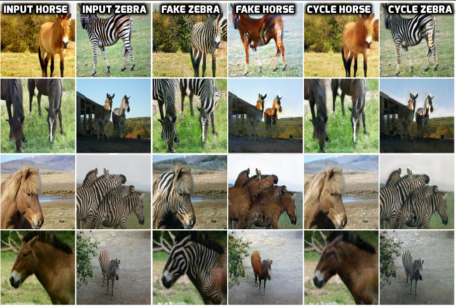

# CycleGAN in TensorFlow

**[update 9/26/2017]** We observed faster convergence and better performance after adding skip connection between input and output in the generator.
在generatot的输入和输出之间添加跳转连接后，我们观察到更快的收敛性和更好的性能。
 To turn the feature on, use switch --skip=True. This is the result of turning on skip after training for 23 epochs:
要打开该特征，请使用switch--skip = True。 这是在23个epochs周期训练后使用skip的结果：


This is the TensorFlow implementation for CycleGAN. The code was written by [Harry Yang](https://www.harryyang.org) and [Nathan Silberman](https://github.com/nathansilberman).

CycleGAN: [[Project]](https://junyanz.github.io/CycleGAN/) [[Paper]](https://arxiv.org/pdf/1703.10593.pdf) 

## Introduction

This code contains two versions of the network architectures and hyper-parameters. The first one is based on the [TensorFlow implementation](https://github.com/hardikbansal/CycleGAN). 
The second one is based on the [official PyTorch implementation](https://github.com/junyanz/pytorch-CycleGAN-and-pix2pix). 
The differences are minor and we observed both versions produced good results. You may need to train several times as the quality of the results are sensitive to the initialization.  
您可能需要多次训练，因为结果的质量对初始化很敏感。
Below is a snapshot of our result at the 50th epoch on one training instance:
下面是我们在第50个周期对一个训练实例的结果的快照：


## Getting Started
### Prepare dataset
* You can either download one of the defaults CycleGAN datasets or use your own dataset. 
您可以下载其中一个默认的CycleGAN数据集或使用您自己的数据集。
	* Download a CycleGAN dataset (e.g. horse2zebra):
	```bash
	bash ./download_datasets.sh horse2zebra
	```
	* Use your own dataset: put images from each domain at folder_a and folder_b respectively. 
使用您自己的数据集：分别将每个域的图像放在folder_a和folder_b处。
* Create the csv file as input to the data loader. 创建csv文件作为数据加载器的输入。
	* Edit the cyclegan_datasets.py file. 编辑cyclegan_datasets.py文件。
	For example, if you have a face2ramen_train dataset which contains 800 face images and 1000 ramen images both in PNG format,
	例如，如果您的face2ramen_train数据集包含以PNG格式显示的800张面部图像和1000张拉面图像，
	 you can just edit the cyclegan_datasets.py as following:您可以编辑cyclegan_datasets.py，如下所示：
	```python
	DATASET_TO_SIZES = {
    'face2ramen_train': 1000
	}

	PATH_TO_CSV = {
    'face2ramen_train': './CycleGAN/input/face2ramen/face2ramen_train.csv'
	}

	DATASET_TO_IMAGETYPE = {
    'face2ramen_train': '.png'
	}

	``` 
	* Run create_cyclegan_dataset.py:
	```bash
	/home/yu/CycleGAN/cyclegan
	python -m cyclegan.create_cyclegan_dataset --image_path_a=folder_a --image_path_b=folder_b --dataset_name="horse2zebra_train" --do_shuffle=0
	python -m create_cyclegan_dataset --image_path_a=folder_a --image_path_b=folder_b --dataset_name="horse2zebra_train" --do_shuffle=0
	```

### Training
* Create the configuration file. The configuration file contains basic information for training/testing. An example of the configuration file could be fond at configs/exp_01.json. 
创建配置文件。配置文件中包含了训练/测试的基本信息。配置文件的一个例子可能会喜欢configs / exp_01.json。
* Start training:开始训练：
```bash
python -m CycleGAN_TensorFlow.main \
    --to_train=1 \
    --log_dir=CycleGAN_TensorFlow/output/cyclegan/exp_01 \
    --config_filename=CycleGAN_TensorFlow/configs/exp_01.json
```
* Check the intermediate results.检查中间结果。
	* Tensorboard
	```bash
	tensorboard --port=6006 --logdir=CycleGAN_TensorFlow/output/cyclegan/exp_01/#timestamp# 
	```
	* Check the html visualization at CycleGAN_TensorFlow/output/cyclegan/exp_01/#timestamp#/epoch_#id#.html.  
在CycleGAN_TensorFlow / output / cyclegan / exp_01 /＃timestamp＃/ epoch_＃id＃.html检查html可视化。
### Restoring from the previous checkpoint.从以前的检查点恢复。
```bash
python -m CycleGAN_TensorFlow.main \
    --to_train=2 \
    --log_dir=CycleGAN_TensorFlow/output/cyclegan/exp_01 \
    --config_filename=CycleGAN_TensorFlow/configs/exp_01.json \
    --checkpoint_dir=CycleGAN_TensorFlow/output/cyclegan/exp_01/#timestamp#
```
### Testing
* Create the testing dataset.创建测试数据集。
	* Edit the cyclegan_datasets.py file the same way as training.以与训练相同的方式编辑cyclegan_datasets.py文件。
	* Create the csv file as the input to the data loader. 
	```bash
	python -m CycleGAN_TensorFlow.create_cyclegan_dataset --image_path_a=folder_a --image_path_b=folder_b --dataset_name="horse2zebra_test" --do_shuffle=0
	```
* Run testing.
```bash
python -m CycleGAN_TensorFlow.main \
    --to_train=0 \
    --log_dir=CycleGAN_TensorFlow/output/cyclegan/exp_01 \
    --config_filename=CycleGAN_TensorFlow/configs/exp_01_test.json \
    --checkpoint_dir=CycleGAN_TensorFlow/output/cyclegan/exp_01/#old_timestamp# 
```
The result is saved in CycleGAN_TensorFlow/output/cyclegan/exp_01/#new_timestamp#.


